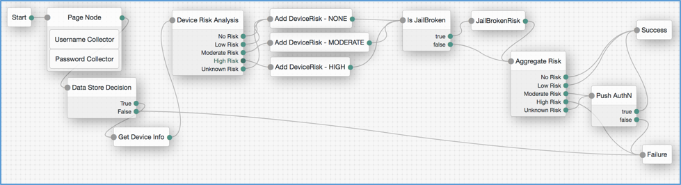
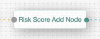
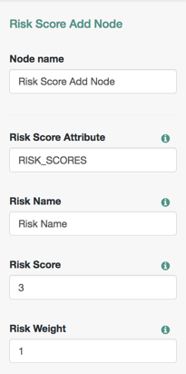
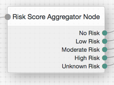
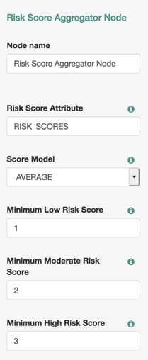

<!--
 * The contents of this file are subject to the terms of the Common Development and
 * Distribution License (the License). You may not use this file except in compliance with the
 * License.
 *
 * You can obtain a copy of the License at legal/CDDLv1.0.txt. See the License for the
 * specific language governing permission and limitations under the License.
 *
 * When distributing Covered Software, include this CDDL Header Notice in each file and include
 * the License file at legal/CDDLv1.0.txt. If applicable, add the following below the CDDL
 * Header, with the fields enclosed by brackets [] replaced by your own identifying
 * information: "Portions copyright [year] [name of copyright owner]".
 *
 * Copyright ${data.get('yyyy')} ForgeRock AS.
 * 
 * Author:  Keith Daly (keith.daly@forgerock.com)
-->
# Risk Score Aggregator Node

###Description###

The risk-score-aggregator-node provides the ability to calculate aggregate risk scores for trees which contain multiple risk inputs.

+ **RiskScoreAddNode** - This node adds an individual risk score to the shared state.  Usually, this node will be placed after the execution of a node that performs an individual risk calculation.  Risk score entries include risk entry name, score value, and weight value.

+ **RiskScoreAggregatorNode** - This node aggregates the individual score entries that have been added during the execution of the tree.  Several statistical models are available, including weighted average score, max score.

&nbsp;&nbsp;&nbsp;&nbsp;

##Build Instructions##

Navigate to the source directory.  Run Maven to build:

    $ mvn clean install

*Note: The code in this repository has binary dependencies that live in the ForgeRock maven repository. Maven can be configured to authenticate to this repository by following the following [ForgeRock Knowledge Base Article](https://backstage.forgerock.com/knowledge/kb/article/a74096897).*

##Installation##

+ Copy the .jar file from the ../target directory into the ../web-container/webapps/openam/WEB-INF/lib directory where AM is deployed.

+ Restart the web container to pick up the new node.  The node will then appear in the authentication trees components palette.

##Configuration / Deployment##

The risk evaluation nodes are deployed as one .jar file (risk-score-node-6.5.0.1-SNAPSHOT.jar).  This .jar file currently provides two nodes that work together to provide comprehensive risk analysis functionality.

--
#####Risk Score Add Node:#####

Place node in-line at the location where a risk score entry needs to be added.

*Note:  This node adds entries to the “risk score attribute” (“RISK_SCORES” by default).*

&nbsp;&nbsp;&nbsp;&nbsp;

--
#####Risk Score Add Node - Configuration:#####

&nbsp;&nbsp;&nbsp;&nbsp;

***Node Name:***
Name for the node in the UI.  (Does not affect calculations.)

***Risk Score Attribute:***
Shared State attribute name to use to store risk entries.  (This variable is available during tree execution only.

***Risk Name:***
Name to use in risk entry.  This will appear in the log file, but does not affect the calculation

***Risk Score:***
Relative score to assign to risk entry.  The value is arbitrary, but must be in proportion to other risk nodes in the tree.  Higher numbers indicate higher risk levels.  *(Suggestion, if in alignment with other nodes in tree: 0=none,1=low,2=moderate,3=high)*

***Risk Weight:***
Relative weight to use for risk entry.  *(Suggestion, if in alignment with other nodes in tree:  Start by assigning all nodes a value of 1 and increase/decrease importance in relation to other nodes.  e.g. If one entry is 3 times more critical than another, start both nodes at 1, then increase the higher to a value of 3.  This keeps the model simpler.)*

--
#####Risk Score Aggregator Node:#####

Place node in-line at the location where a risk score calculation needs to be evaluated.

*Note:  This node adds entries to the “risk score attribute” (“RISK_SCORES” by default).*

&nbsp;&nbsp;&nbsp;&nbsp;

--
#####Risk Score Aggregator Node - Configuration:#####

&nbsp;&nbsp;&nbsp;&nbsp;

***Node Name:***
Name for the node in the UI.  (Does not affect calculations.)

***Risk Score Attribute:***
Shared State attribute name to use to calculate risk entries.  *(This variable is available during tree execution only.)*

***Score Model:***
AVERAGE:	Weighted average ( ∑(score * weight) / ∑(weight) )
MAXIMUM:	Maximum score value ( MAX (score) )
TOTAL:	Total weighted average ( ∑ (score * weight) )

***Minimum Low Risk Score:***
Minimum value for low risk score.  *(Note:  Any numbers 0 up to this value will be “no risk”.)*

***Minimum Moderate Risk Score:***
Minimum value for moderate risk score.  *(Note:  Any numbers from the minimum risk threshold up to this value will be “low risk”.)*

***Minimum High Risk Score:***
Minimum value for moderate risk score.  *(Note:  Any numbers minimum risk threshold up to this value will be “moderate risk”.)*

##Sample Deployment##

&nbsp;&nbsp;&nbsp;&nbsp;

In the example above, the following simple authentication journey is shown:

1.  User enters username and password.
2.  User credentials are validated against the LDAP
3.  Based on the username provided, a service is called to retrieve a “security document” containing device hygiene detail.  The contents of this document is stored in the authentication flow’s “shared state”.
4.  The device risk score is retrieved form the shared state.  Depending on the range defined, the node exits with a NONE, LOW, MODERATE, HIGH, or UNKNOWN judgement.  (This is either a standard, scripted, or custom node.)
5.  Risk Score Add Nodes are inserted in-line to add risk score entries to the shared state risk variable.
6.  Another evaluator is executed against the security document (same as step 4).
7.  Risk Score Add Nodes are inserted in-line to add risk score entries to the shared state risk variable.  (Note that, for this instance, no risk entries are created for a non-jailbroken device – this is a business rule decision).
8.  The Risk Score Aggregator Node collects all risk entries in shared state and applies a scoring model (currently MAXIMUM, AVERAGE, or TOTAL).  The module exists with a risk adjudication of NONE, LOW, MODERATE, HIGH, or UNKNOWN.
9.  Depending on the exit, the system invokes a push authentication, succeeds, or fails.

--     
**TERMS OF USE**

*The sample code described herein is provided on an "as is" basis, without warranty of any kind, to the fullest extent permitted by law. ForgeRock does not warrant or guarantee the individual success developers may have in implementing the sample code on their development platforms or in production configurations.*

*ForgeRock does not warrant, guarantee or make any representations regarding the use, results of use, accuracy, timeliness or completeness of any data or information relating to the sample code. ForgeRock disclaims all warranties, expressed or implied, and in particular, disclaims all warranties of merchantability, and warranties related to the code, or any service or software related thereto.*

*ForgeRock shall not be liable for any direct, indirect or consequential damages or costs of any type arising out of any action taken by you or others related to the sample code.*
 